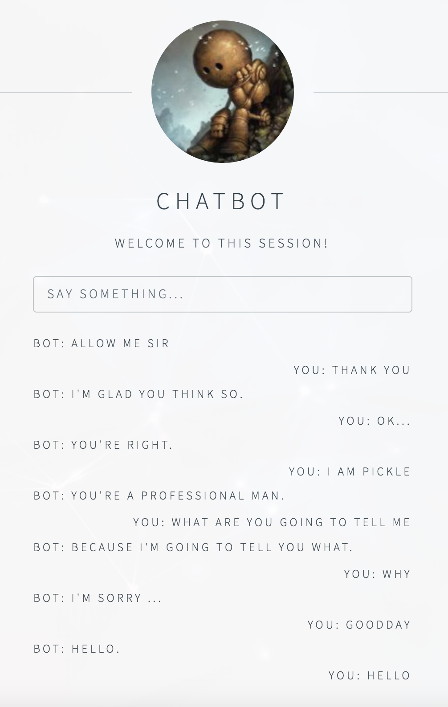

# NLP Lecture 11练习

进行的工作：

1. 使用项目中原参数进行训练，获得的结果测试较差，大部分的回答都是 I Don't Know.

2. 修改参数，增大 Epoch 数量与调整 dropout 率，使用2080 Ti GPU服务器训练5小时完成， 训练过程的标准输出保存在 record.txt文件中。

3. 尝试使用来自[candlewill/Dialog_Corpus](https://github.com/candlewill/Dialog_Corpus)的中文对话语料库修改为程序接受的格式后与 [Kyubyong/wordvectors](https://github.com/Kyubyong/wordvectors)中的中文预训练词向量进行训练，修改 textdata.py 中`nltk.word_tokenize`分词为`jieba.cut`，修改corpus/**lightweightdata.py**中打开文件时使用`open(fileName, 'r', encoding='utf-8')`，以正确读取中文内容。执行训练的指令为：

   ```shell
   python3 main.py --corpus lightweight --datasetTag dialog --embeddingSource zh.bin >train.log
   ```

   但是第一次训练获得的模型对所有问题都是相同回答，调整参数重新训练的耗时较长，尚未完成。

4. 通过 chatbot_website 搭建 chatbot 的网页界面，方法是将save/model下的所有文件拷贝至 save/model-server 下，然后运行以下命令安装所需库：

   ```shell
   pip3 install channels==1.1.6
   pip3 install django==1.10
   pip3 install asgi_redis
   ```

   由于django 新版本不向后兼容，因此安装时需指定需要的版本。

   安装后运行以下命令启动 web 服务：

   ```shell
   export CHATBOT_SECRET_KEY="my-secret-key"
   python manage.py makemigrations
   python manage.py migrate
   redis-server & 
   python manage.py runserver
   ```

   启动后效果如下图所示：

   