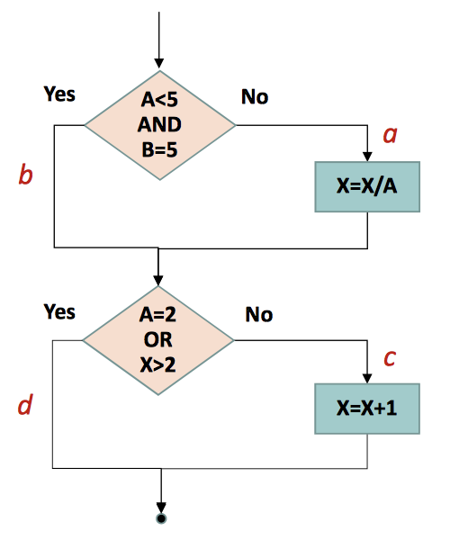

# Assignment 5.

1. 根据右边的程序流程图，完成：

    

   1. 画出相应的程序控制流图；

      

   2.  给出控制流图的邻接矩阵；

      $$\begin{pmatrix}0 & 1 & 1 & 0 & 0 & 0 & 0 & 0 & 0\\ 0 & 0 & 1 & 1 & 0 & 0 & 0 & 0 & 0\\ 0 & 0 & 0 & 1 & 0 & 0 & 0 & 0 & 0\\ 0 & 0 & 0 & 0 & 1 & 0 & 0 & 0 & 0\\ 0 & 0 & 0 & 0 & 0 & 1 & 0 & 1 & 0\\ 0 & 0 & 0 & 0 & 0 & 0 & 1 & 1 & 0\\ 0 & 0 & 0 & 0 & 0 & 0 & 0 & 1 & 0\\ 0 & 0 & 0 & 0 & 0 & 0 & 0 & 0 & 1\\ 0 & 0 & 0 & 0 & 0 & 0 & 0 & 0 & 0\\ \end{pmatrix}$$

   3.  计算 McCabe 环形复杂度；

      $V(G)=m-n+2p=12-9+2=5 ​$

   4. 找出程序的一个独立路径集合。

      - 1-2-4-5-8-9
      - 1-3-4-5-8-9
      - 1-2-3-4-5-8-9
      - 1-2-4-5-6-8-9
      - 1-2-4-5-6-7-8-9
