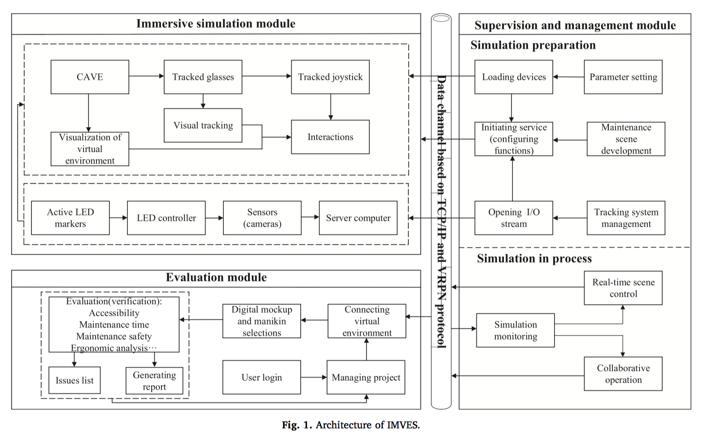
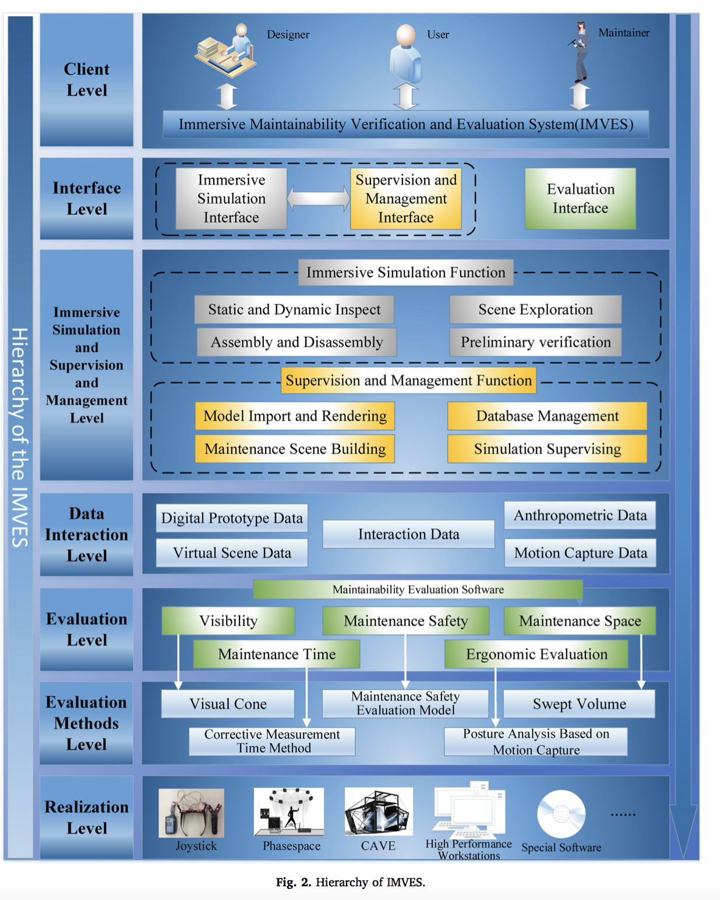
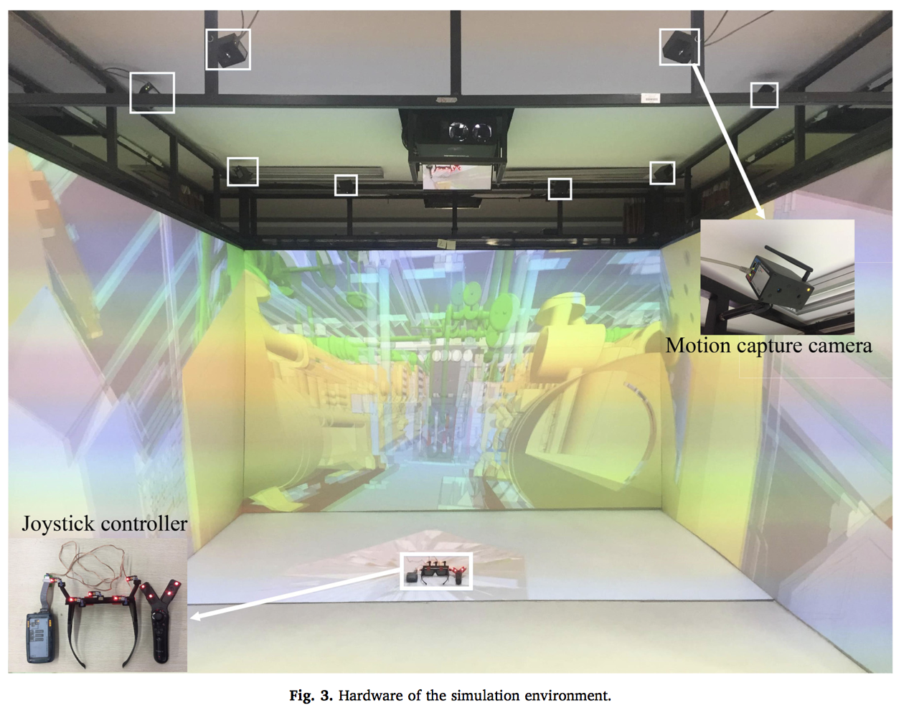
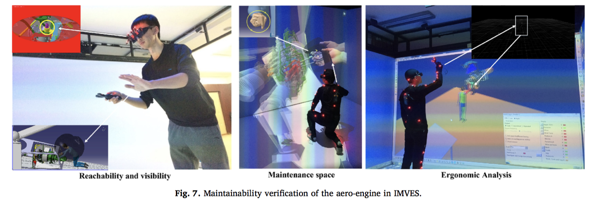

# 利用 VR 技术辅助提升产品可维护性

具有良好可维护性的产品可以在产品生命周期中降低维护成本并减少风险发生，因此对可维护性方面的设计应当是产品设计的早期就被考虑到的。然而传统的设计工具对于可维护性方面的设计效率并不高，Using virtual reality to support the product’s maintainability design: Immersive maintainability verification and evaluation system一文中提出了使用 VR 技术开发一种沉浸式的产品可维护性评估系统（IMVES）以降低开发成本，加快开发速度以及提升设计精度。在引擎、机械的维护设计中可以得到一定的应用。

论文中指出了当前产品设计方法中导致效率低下的三个主要原因：

- 当前的辅助设计工具主要是台式电脑软件，对于产品的电子模拟只能以一种静态的方式进行，而产品维护是一种动态的过程，而静态过程无法反映出维护过程中存在的一些缺点
- 电脑软件的模拟往往是基于动画的，关键帧的质量对于模拟较为关键，而为了让关键帧能够正确反映维护过程，设计者需要不断进行调整，这个过程非常耗时
- 传统的可维护性设计方法过于依赖经验，而经验是主观的。并不参与实际维护过程的设计师因此缺少对于实际状况下的理解，从而导致设计中缺陷的出现

利用 VR 技术，可以创建一个有沉浸感的虚拟环境以模拟动态的维护工作流程，用户可以与虚拟环境进行更为直接的互动，使得设计流程大幅加快，准确度也更高。

论文中提出的沉浸式维护评估系统架构如下：

系统主要由三个模块组成：沉浸式模拟模块，管理模块和评估模块，模块间使用 TCP/IP 进行数据传输。用户通过手柄与虚拟环境中的物件进行交互，交互数据与用户行为将被记录并由评估组件进行评估。

论文中也提到了实现 IMEVS 的硬件设施，使用 CAVE 系统作为沉浸式模拟的视觉环境，相较于头戴式的显示器，CAVE 环境下用户可以更轻松地观察环境并获得更为真实的模拟体验。系统中使用了光学的动作捕捉系统收集穿着带 LED 灯的测试服的用户的动作数据用于评估。系统需要配备有具有足够的图形处理与计算能力的工作站才能达到足够高的稳定性与效率。

IMEVS 的架构如下：

系统模拟环境如下：

论文中提出的对可维护性的评估方法有：根据物件对维护者而言是否有着较好的可视性进行评分，根据维护时间与人体工学分析进行评估，根据维护过程中的安全性建立模型进行评估。

对于评估的图示如下：

当前论文提出的系统仍然存在着一些问题：

- IMVES 仍然是基于模拟的系统，在模拟中发现的问题仍然需要通过实体测试进行确认
- 模拟过程中用户与环境的交互方式仍然局限于手柄等设备，而且通过 VR 研究捕获用户所见的物件的方法对于模拟仍不够精确，对于实际维护流程中维护人员动作的模拟仍需要研究
- IMVES 是一个较为复杂的系统，实现中需要大量的特殊计算机硬件与软件的支持，实现完整功能的系统难度较高。